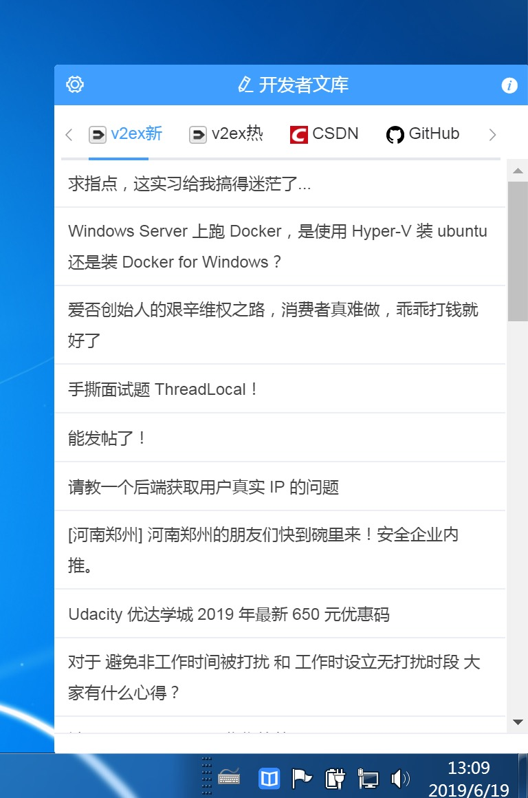

# 开发者文库

> 一款网络文章本地离线进行聚合的跨平台开源APP

## 下载地址

https://github.com/cteams/Wenku/releases

## 使用效果

**MAC**

**WIN**

## 支持站点

名称 | 地址
:- | :-
v2ex - 最新 | https://www.v2ex.com
v2ex - 最热 | -
开发者头条 - 今日内容 | https://toutiao.io
Segmentfault - 日热门 | https://segmentfault.com/hottest
伯乐在线 - 最新内容 | http://blog.jobbole.com 
CSDN - 最新推荐 | https://blog.csdn.net
Github - 今日最热 | https://github.com/explore?since=weekly#trending
Gitbook - 最新内容 | https://gitbook.cn
Freebuf - 最新内容 | https://www.freebuf.com
51CTO - 最新内容 | https://blog.51cto.com
InfoQ - 7天最热 | https://www.infoq.cn/hotlist?tag=day
慕课手记 - 推荐内容 | https://www.imooc.com/article
开源中国 - 最新内容 | https://www.oschina.net
开源中国 - 职业问答 | https://www.oschina.net/question?catalog=100
开源中国 - 开源访谈 | https://www.oschina.net/question/topic/osc-intervie

## 关于

- 出品：C.TEAM
- E-mail：service@c.team
